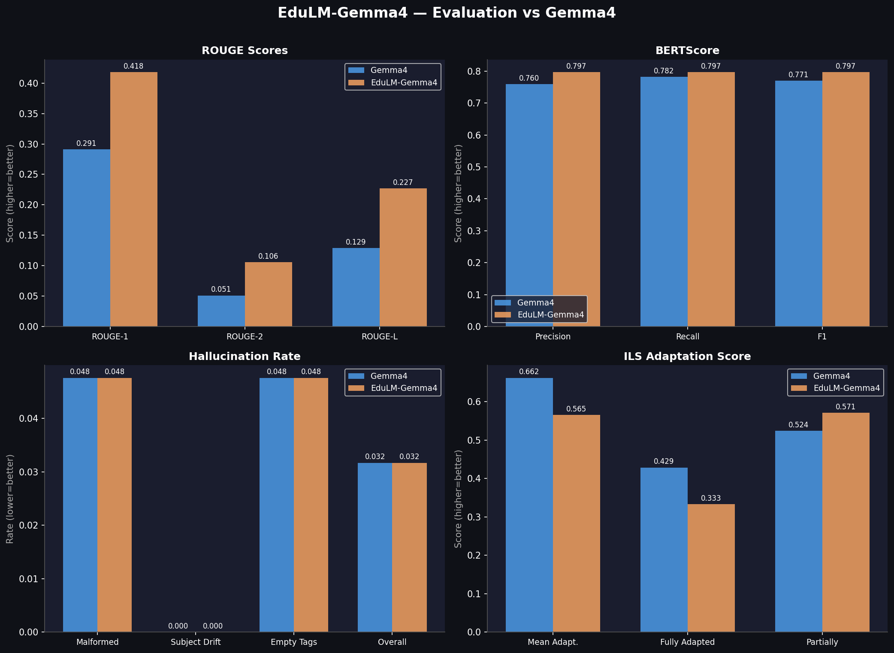

# Evaluation Results
 
## EduLM-Gemma4 vs Gemma4 (gemma-4-e4b-it, no fine-tuning)
 
| Metric | Gemma4 | EduLM-Gemma4 | Δ |
|--------|----------|-----------|---|
| ROUGE-1 | 0.2909 | 0.4181 | +0.1272 |
| ROUGE-2 | 0.0510 | 0.1059 | +0.0549 |
| ROUGE-L | 0.1291 | 0.2269 | +0.0978 |
| BERTScore F1 | 0.7706 | 0.7966 | +0.0260 |
| Hallucination Rate | 0.0317 | 0.0317 | -0.0000 |
| ILS Adaptation | 0.6619 | 0.5651 | +-0.0968 |
 

