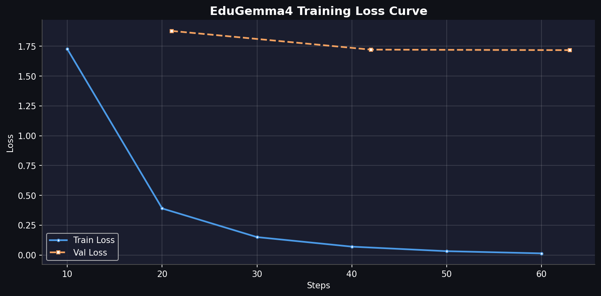

# Training Summary

| Metric | Value |
|--------|-------|
| Base Model | gemma-4-e4b-it |
| LoRA Rank | 16 |
| LoRA Alpha | 32 |
| Epochs | 3 |
| Learning Rate | 0.0002 |
| Final Train Loss | 0.0133 |
| Best Val Loss | 1.7059475183486938 |
| HuggingFace | https://huggingface.co/kasi-ranaweera/edulm-gemma4-e4b-lora |
 

